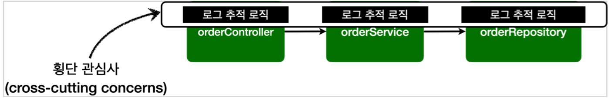
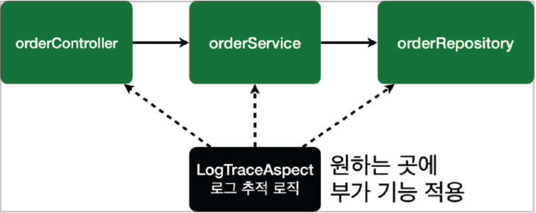

# Intro
안녕하세요. 최혜정 사원입니다.
Vue 강의를 듣고 Vue의 탄생에 대해서 적어보려고 합니다.  

# 1. Virtual DOM
Virtual DOM(가상 DOM)이란 실제 DOM을 가상화한 객체
- DOM이 생성되기 전, 이전 상태 값과 수정사항을 비교하여 달라진 부분만 DOM에게 한 번에 전달하여 딱 한 번만 렌더링을 진행한다.
- 속도 저하를 예방할 수 있다.

## 1-1. Virtual DOM 동작 방식
1. 새로운 요소가 UI에 추가되면 전체 UI를 Virtual DOM에 리렌더링 한다.
2. 현재 Virtual DOM과 이전 Virtual DOM을 비교해 차이를 계산한다. (가상 돔 끼리 비교)
3. 변경된 부분을 실제 DOM에 반영한다.
 

# 2. Vue, React, Angular 비교

**[Vue vs React]**
1. Vue는 프레임워크이며, React는 라이브러리이다.
  - 라이브러리는 사용자가 필요할 때에 가져다 썼다 뺐다 할 수 있고 부분적으로 사용이 가능하다.
  - 프레임워크는 부분적 사용이 불가능하고 프레임워크 안으로 들어가서 프레임워크가 지원해주는 문법에 따라서 작성해줘야 제대로 동작한다.
  - 따라서 React 는 자유도가 높으며, Vue 는 한 가지 방식대로 한다.

  
로그 추적 로직이 부가기능이다. 그런데 이 부가기능을 여러 곳에서 공통으로 사용하면 각 핵심기능마다 부가기능을 추가해줘야한다.  
이 경우 코드의 중복이 발생하고, 핵심과 부가기능이 공존하기 때문에 유지보수가 어렵다.  

  
이러한 부가 기능은 **횡단 관심사**(cross-cutting concerns)가 된다.  **즉, 하나의 부가 기능이 여러 곳에 동일하게 사용된다는 뜻이다.**

그런데 로그찍는 방법이 달라졌는데 컴포넌트가 100개가 넘는다면 100개가 넘는 로직를 뜯어고쳐야한다.   
해결방법 -> 이 공통 부가기능인 횡단 관심사를 핵심기능과 완전히 분리하고자 하는 취지에서 나온것이 AOP 개념이다.  

 

부가기능을 각각의 코드에 넣기보다 따로 빼서 관리하는 것이 유지보수면에서 효율적이다.   
그래서 이 **"부가기능"과 "부가기능을 어디에 적용할지 선택하는 기능"을 합쳐서 하나의 모듈**로 만들었는데, 이것이 **Aspect**이다.   

이렇게 Aspect를 사용한 프로그래밍 방식을 관점 지향 프로그래밍 AOP(Aspect-Oriented Programming)라고 한다.

## 2-1. AOP 적용 방식
