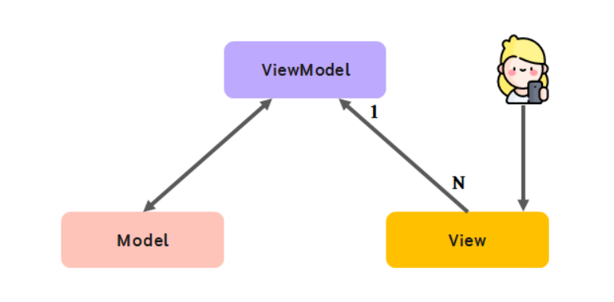

# Intro
안녕하세요. 최혜정 사원입니다.
Vuex에 대해서 적어보려고 합니다.  

# 1. Vuex란?
- Vue.js 애플리케이션의 모든 컴포넌트에 대한 중앙 집중식 저장소 역할
- 애플리케이션에서 사용하는 모든 데이터를 중앙에서 관리하여, 규모가 크고 복잡한 애플리케이션의 컴포넌트들을 효율적으로 관리할 수 있다.

# 2. Vuex 등록
```javascript
// store.js
import Vue from 'vue';
import Vuex from 'vuex';

Vue.use(Vuex); // Vue랑 Vuex 연결

export const store = new Vuex.Store({
  
});
```

```javascript
// main.js
import { store } from './store/store.js';

new Vue({
  ...,
  store,
  ...
});
```

# 3. Vuex 구조

## state
- 여러 컴포넌트에 공유되는 데이터 data
- 원본 소스의 역할을 하며, View와 직접적으로 연결되어있는 Model
- state는 mutation을 통해서만 변경이 가능
  - mutation을 통해 state가 변경이 일어나면 반응적으로 View가 업데이트

```javascript
// Vue
data: {
  message: 'Hello Vue.js!'
}

// Vuex
state: {
  message: 'Hello Vue.js!'
}

<!-- Vue -->
<p>{{ message }}</p>

<!-- Vuex -->
<p>{{ this.$store.state.message }}</p>
```

## mutations
- state 값을 변경하는 이벤트 로직,메서드 methods
- commit 메서드로 호출할 수 있다.
- 첫번째 인자는 mutation 이름, 두번째 인자에 데이터를 넘겨준다.

```javascript
// store.js
state: { num: 10 },
mutations: {
  printNum(state) {
    return state.num;
  },
  sumNum(state, anotherNum) {
    return state.num + anotherNum;
  }
}

// App.vue
this.$store.commit('printNum');
this.$store.commit('sumNum', 20);
```

## getters
- 연산된 state 값을 접근하는 속성 computed

```javascript
// store.js
state: {
  num: 10
},
getters: {
  getNum(state) {
    return state.num;
  },
  doubleNum(state) {
    return state.num * 2;
  }
}

<p>{{ this.$store.getters.getNum }}</p>
<p>{{ this.$store.getters.doubleNum }}</p>
```

## actions
- 비동기 처리 로직을 선언하는 메서드 async methods
- dispatch('함수명', '전달인자')를 통해서 실행시킬 수 있다.
- context 객체를 전달인자로 받는다.
- context 객체는 store의 메소드와 속성들을 가지고 있는 객체이다.
- context.commit를 호출하여 Mutation의 핸들러를 호출하거나, context.state와 context.getters를 통해 state와 getter에 접근 할 수 있다.


mutation은 동기 작업을 통해 state에 있는 데이터를 바꾸죠.

components에서 직접  mutation을 commit 하는 루트는 없습니다. 

action을 거쳐야 하지요. 

반면 action은 state를 변이 할 때 mutation을 거쳐야 합니다.

```javascript

// store.js
mutation: {
    doubleNumber(state) {
        state.num * 2;
    }
},
actions: {
    delayDoubleNumber(context) { 
        // context로 store의 메서드와 속성 접근
        context.commit('doubleNumber');
    }
}

// App.vue
// dispatch로 actions 호출
this.$store.dispatch('delayDoubleNumber');
```

# 4. Pinia
- Composition API 기반에서 동작하는 상태 관리자
- Vuex와의 가장 큰 차이점은 mutations 선언 필요 없이 actions에서 값을 변화 시킬 수 있게 되었다.
- defineStore 함수를 이용하여 각각의 파일마다 별도의 store를 정의하여 module의 기능을 대신한다.  
- Vuex의 this.$store와는 달리 defineStore가 반환하는 hook을 이용하여 store에 아주 쉽게 접근할 수 있습니다.
- defineStore<모듈명, 타입>

## Pinia 등록
```javascript
import { createPinia } from 'pinia'
import { createApp } from 'vue'
import App from './App.vue'

const pinia = createPinia();
const app = createApp(App);

app.use(pinia);   // main.js에 app.use를 통해 등록

app.mount('#app')
```

## Options API
```javascript
// stores/counter.js
import { defineStore } from "pinia";

export const useCounterStore = defineStore('counter', {
  state: () => ({
    count: 1
  }),
  getters: {
        doubleCount: state => state.count * 2
  },
  actions: {
    increment() {
      this.count++
    }
  }
})
```

## Composition API
```javascript
import { defineStore } from "pinia";
import { computed, ref } from "vue";

export const useCounterStore = defineStore('counter', () => {
    const count = ref(2);
    const name = ref('ethan');
    const doubleCount = computed(() => count.value * 2);
    function increment() {
      count.value++
    }

    return { count, name, doubleCount, increment };
})
```
- ref() → state
- computed() → getters
- function() → actions

## App.vue
```javascript
setup() {
  const counterStore = useCounterStore();
  const { increment, name, count, doubleCount  } = counterStore;

  return {
    name,
    count, 
    doubleCount,
    increment
  }
}
```
- 구조분해할당을 통해 변수를 선언하고 return 해줄 경우 imcrement를 통해count 값을 변경해도 화면에서는 변경되지 않는다. 

```javascript
setup() {
    
  const counterStore = useCounterStore();
  const { name, count, doubleCount } = storeToRefs(counterStore);
  const { increment } = counterStore;

  return {
    name, count, doubleCount, increment
  }
}
```


storeToRefs 안에 store를 넘겨준 후 구조분해할당을 통해 가져올 경우 반응형이 꺠지지 않아서 정상적으로 동작이 된다.

# 5. Vuex vs Pinia     
- Pinia는 TypeScript를 지원한다.


구조 분해 할당은 배열이나 객체의 속성을 해체해서 그 값을 개별 변수에 담을 수 있게 하는 자바스크립트 표현식이다.

## 동작방식
 

