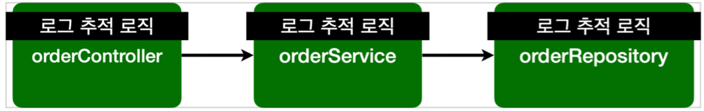
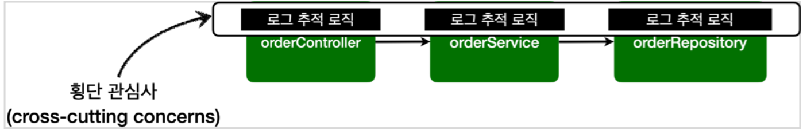
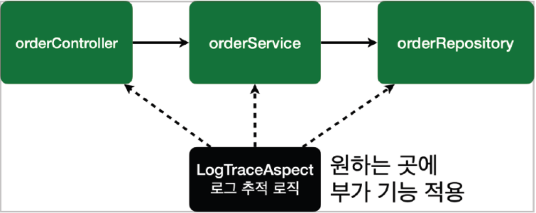

# Intro
안녕하세요. 최혜정 사원입니다.
인프런 스프링 핵심원리 고급편을 수강하고 스프링 AOP에 대해서 적어보려고 합니다.  

**https://www.inflearn.com/course/스프링-핵심-원리-고급편/dashboard**  
**[참고] 작성자는 Windows, STS 환경에서 따라해보았습니다.**  

# 프로젝트 생성

# 1. 프록시
프록시는 기존 코드를 수정하지 않고 코드 중복을 피할 수 있는 방법으로써 다음과 같은 특징을 지님  
- 핵심 기능의 실행은 다른 객체에 위임하고 부가적인 기능을 제공하는 객체 = 프록시(proxy)
- 실제 핵심 기능을 실행하는 객체 = 대상 객체
- 프록시는 핵심 기능을 구현하지 않음
- 대신 여러 객체에 공통으로 적용할 수 있는 기능을 구현

# 1. AOP 개념
AOP란 Apsects Oriented Programming 으로, **관점 지향 프로그래밍**의 약자이다.  
여러 객체에 공통으로 적용할 수 있는 기능을 분리해 재사용성을 높여주는 기법으로써 다음과 같은 특징을 지님
- 공통 기능 구현(부가 기능)과 핵심 기능 구현의 분리
- 핵심 기능에 공통 기능을 삽입하며 다음과 같은 방법이 존재  

실제 요청을 받아 들이고 처리하는 로직을 **핵심기능**이라고 하고 핵심 기능을 보조하여 가령 로그를 남겨주는 로직을 **부가 기능**이라고 한다.    

  
로그 추적 로직이 부가기능이다. 그런데 이 부가기능을 여러 곳에서 공통으로 사용하면 각 핵심기능마다 부가기능을 추가해줘야한다.  
이 경우 코드의 중복이 발생하고, 핵심과 부가기능이 공존하기 때문에 유지보수가 어렵다.  

  
이러한 부가 기능은 **횡단 관심사**(cross-cutting concerns)가 된다.  **즉, 하나의 부가 기능이 여러 곳에 동일하게 사용된다는 뜻이다.**

그런데 로그찍는 방법이 달라졌는데 컴포넌트가 100개가 넘는다면 100개가 넘는 로직를 뜯어고쳐야한다.   
해결방법 -> 이 공통 부가기능인 횡단 관심사를 핵심기능과 완전히 분리하고자 하는 취지에서 나온것이 AOP 개념이다.  

## 1-1. 스프링 AOP 용어
- 스프링 AOP는 프록시 객체를 자동으로 생성해줌
- AOP의 공통 기능을 Aspect라 칭하며, 아래와 같은 주요 용어가 존재

  - Joinpoint: AOP를 적용할 수 있는 지점
  - Pointcut: 조인 포인트 중 어드바이스 적용될 위치를 정하는 기능, 즉 어느 메서드에 부가기능을 적용할지 정하는 기능
  - Advice: 부가 기능 로직
  - Advisor: 하나의 Advice + 하나의 Pointcut
  - Weaving: 타겟의 조인포인트에 어드바이스를 적용하는 것을 말한다. 즉 실제객체 코드에 부가기능을 추가하는 것
  - Aspect: 여러 객체에 공통으로 적용되는 기능, 여러 어드바이스 + 포인트컷을 모듈화 한것 (@Aspect)
  - Target : 어드바이스를 적용할 실제객체

# 2. @Aspect
- 스프링 앱에 프록시를 적용하려면 포인트컷과 어드바이스로 구성된 어드바이저를 만들어 스프링 빈으로 등록하면 된다.
- 스프링은 @Aspect 애노테이션으로 Advisor를 편리하게 생성할 때 사용한다.
- @Around 로 Pointcut 을 명시하고, execute 메서드 내부에 Advice 를 구현하면 끝이다. 그 후 스프링 빈으로 등록하면 된다.

## 2-1. @Aspect -> Advisor 변환 과정
@Aspect를 Advisor로 변환하는 것은 자동 프록시 생성기가 담당한다.  

**자동 프록시 생성기가 하는일**
1. @Aspect 를 Advisor로 변환하는 일  
2. Advisor를 바탕으로 프록시객체를 생성

  

**@Aspect를 어드바이저로 변환해서 저장하는 과정**
1. 스프링 어플리케이션 로딩 시점에 자동 프록시 생성기가 호출된다. 
2. 스프링 컨테이너에서 @Aspect 애노테이션이 붙은 스프링 빈을 모두 조회한다. 
3. @Aspect 어드바이저 빌더를 통해 @Aspect 애노테이션 저옵를 기반으로 Advisor 를 생성한다.
4. 생성한 어드바이저를 @Aspect 어드바이저 빌더 내부에 저장한다.

 

**프록시객체 생성과정**
1. 생성: 스프링 빈 대상이 되는 객체를 생성한다. (@Bean, 컴포넌트 스캔 모두 포함)
2. 전달: 생성된 객체를 빈 저장소에 등록하기 직전에 빈 후처리기에 전달한다.
3-1. Advisor 빈 조회: 스프링 컨테이너에서 Advisor 빈을 모두 조회한다.
3-2. @Aspect Advisor 조회: @Aspect 어드바이저 빌더 내부에 저장된 Advisor를 모두 조회한다.
4. 프록시 적용 대상 체크 : 조회한 Advisor에 포함되어 있는 포인트컷을 사용해서 해당 객체가 프록시를 적용할 대상인지 아닌지 판단한다.
5. 프록시 생성: 프록시 적용 대상이면 프록시를 생성하고 프록시를 반환한다. 그래서 프록시를 스프링빈으로 등록한다.
6. 빈 등록: 반환된 객체는 스프링 빈으로 등록된다.

 

부가기능을 각각의 코드에 넣기보다 따로 빼서 관리하는 것이 유지보수면에서 효율적이다.   
그래서 이 "부가기능"과 "부가기능을 어디에 적용할지 선택하는 기능"을 합쳐서 하나의 모듈로 만들었는데, 이것이 Aspect이다.   

이렇게 Aspect를 사용한 프로그래밍 방식을 관점 지향 프로그래밍 AOP(Aspect-Oriented Programming)라고 한다.

<런타임>
객체를 스프링 컨테이너를 통해 전달하면 빈 포스트 프로세서에서 AspectJ모듈을 보고 적용대상이면 프록시를 만들고 프록시를 스프링빈에 등록한다.

